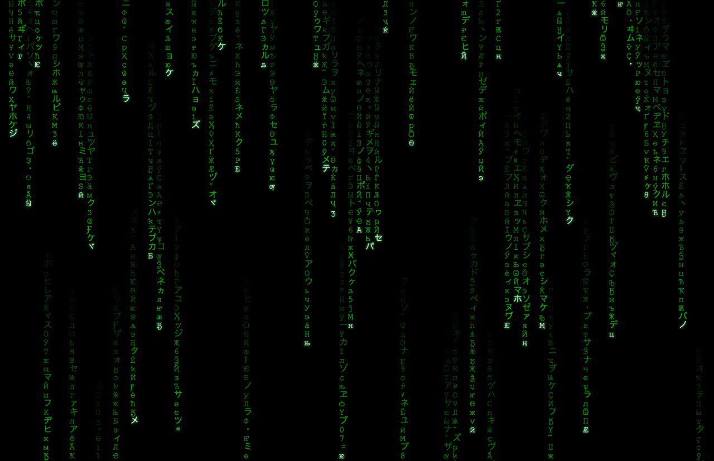

# neo-matrix-rain

A macOS screensaver showing the classic Matrix digital rain — falling katakana, Cyrillic and digit characters on a black background with a green gradient trail.

Built with Swift and CoreGraphics. No dependencies, no web views.



## Requirements

- macOS 12 or later (Apple Silicon and Intel)
- Xcode Command Line Tools (`xcode-select --install`)

## Install

```bash
bash build.sh
```

Then open **System Settings → Screen Saver** and select **Neo Matrix Rain**.

If macOS shows a security warning, go to **System Settings → Privacy & Security → scroll down → Open Anyway**.

## Preview before installing

```bash
bash test.sh
```

Opens a 1280×720 window so you can see the animation before committing to installation. Press **Q** or close the window to quit.

## Uninstall

```bash
rm -rf ~/Library/Screen\ Savers/NeoMatrixRain.saver
```

## Configuration

All visual parameters are constants at the top of `Sources/NeoMatrixView.swift`:

| Constant | Default | Description |
|---|---|---|
| `fontSize` | `22` | Character size in points |
| `trailLen` | `24` | Number of characters in the fading trail |
| `minSpeed` | `0.10` | Slowest column speed (rows per frame) |
| `maxSpeed` | `0.35` | Fastest column speed (rows per frame) |
| `flickerChance` | `0.01` | Probability a trail character changes each frame |

After editing, run `bash build.sh` to rebuild and reinstall.

## Character set

The rain draws randomly from:
- **Katakana** — Unicode block U+30A0–U+30FF (the original Matrix look)
- **Cyrillic** — Unicode block U+0400–U+04FF
- **Digits** — 0–9

## License

MIT
