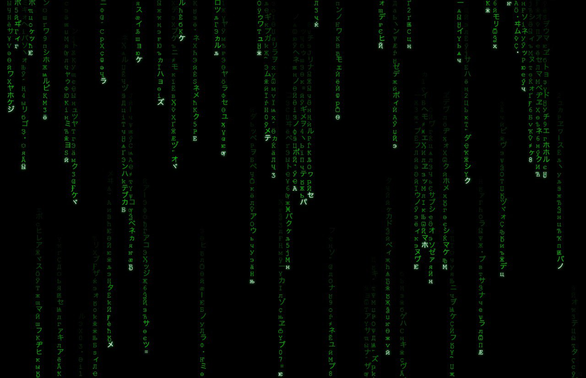

# Neo Matrix Rain

A macOS screensaver showing the classic digital rain — falling katakana, Cyrillic and digit characters on a black background with a green gradient trail.

Built with Swift and CoreGraphics. No dependencies, no web views. Runs natively on Apple Silicon and Intel.



[](https://ko-fi.com/anatoliypivovarov)

If you enjoy this screensaver, consider buying me a coffee ☕ — it keeps the project alive and motivates new features.

---

## Requirements

- macOS 12 or later (Apple Silicon and Intel)
- Xcode Command Line Tools (`xcode-select --install`)

## Install

```bash
bash build.sh
```

Then open **System Settings → Screen Saver** and select **Neo Matrix Rain**.

If macOS shows a security warning, go to **System Settings → Privacy & Security → scroll down → Open Anyway**.

## Preview before installing

```bash
bash test.sh
```

Opens a 1280×720 window so you can see the animation before committing to installation. Press **Q** or close the window to quit.

## Uninstall

```bash
rm -rf ~/Library/Screen\ Savers/NeoMatrixRain.saver
```

## Configuration

All visual parameters are constants at the top of `Sources/NeoMatrixView.swift`:

| Constant | Default | Description |
|---|---|---|
| `fontSize` | `22` | Character size in points |
| `trailLen` | `24` | Number of characters in the fading trail |
| `minSpeed` | `0.10` | Slowest column speed (rows per frame) |
| `maxSpeed` | `0.35` | Fastest column speed (rows per frame) |
| `flickerChance` | `0.01` | Probability a trail character changes each frame |

After editing, run `bash build.sh` to rebuild and reinstall.

## Character set

The rain draws randomly from:
- **Katakana** — Unicode block U+30A0–U+30FF (the original Matrix look)
- **Cyrillic** — Unicode block U+0400–U+04FF
- **Digits** — 0–9

## Roadmap

- [ ] Settings UI — adjust speed, density, colors without editing code
- [ ] Color themes — green, blue, red, white, custom RGB
- [ ] Custom character sets — add your own symbols
- [ ] Multi-monitor support
- [ ] macOS Sonoma / Sequoia optimizations

Have a feature idea? [Open an issue](https://github.com/pivovarovanatol/neo-matrix-rain/issues) or support development on [Ko-fi](https://ko-fi.com/anatoliypivovarov).

## License

MIT

---

> **Disclaimer:** "The Matrix" is a trademark of Warner Bros. Entertainment Inc. This project is an independent open-source implementation of a digital rain animation effect and is not affiliated with, endorsed by, or connected to Warner Bros. or the Matrix franchise in any way.
